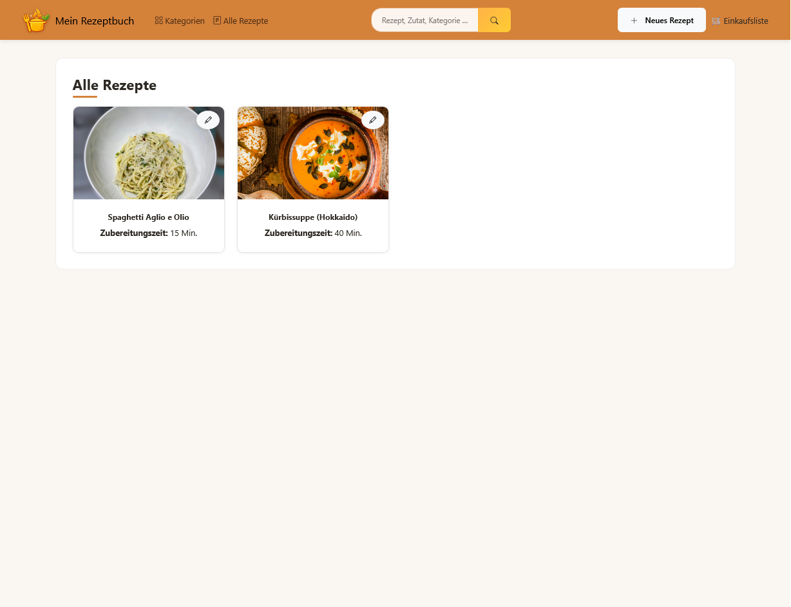
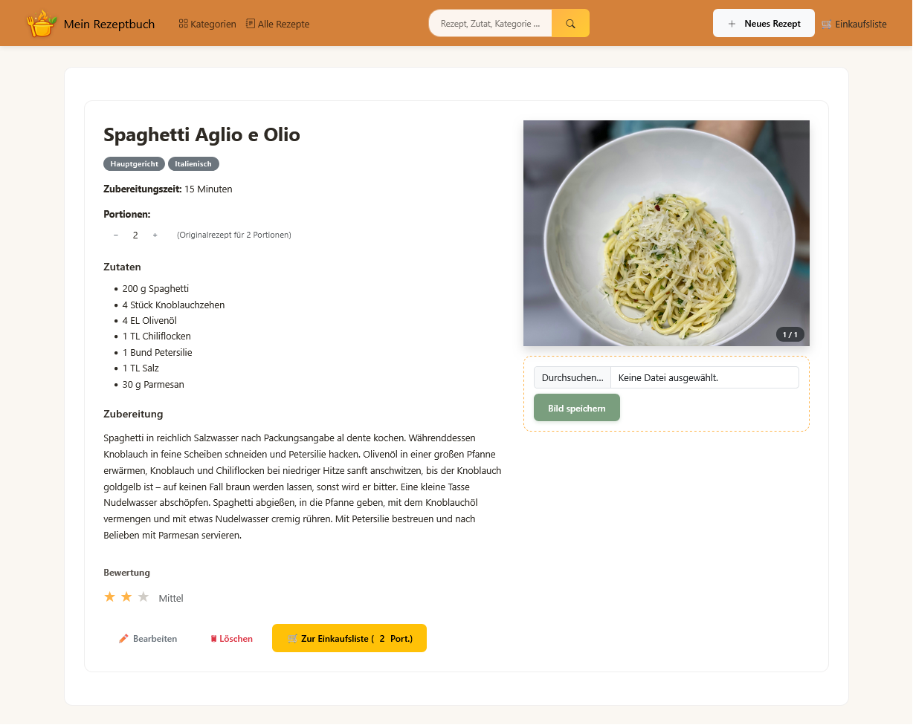
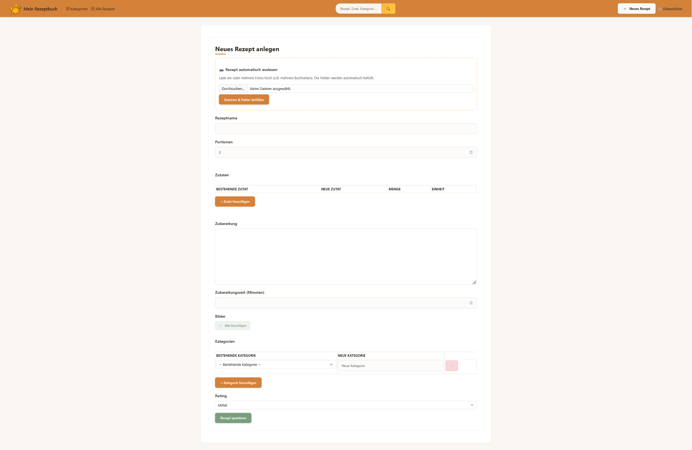
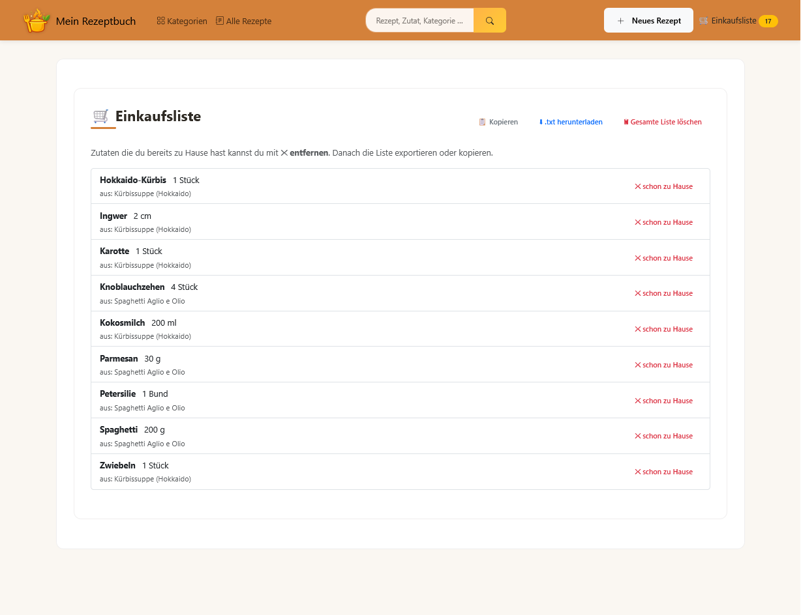

# Mein Rezeptbuch

> Web-Anwendung zur Verwaltung von Kochrezepten mit KI-gestützter
> Bilderkennung. Entwickelt im Studiengang Medieninformatik an der Ostfalia.

🇬🇧 *English version below.*

## Features

- **Rezepte verwalten**: Anlegen, bearbeiten, löschen mit Zutaten,
  Kategorien, Bewertung und Zubereitungszeit
- **KI-Rezept-Scan**: Foto oder PDF einer Rezeptseite hochladen,
  Google Gemini extrahiert automatisch alle Felder
- **Mehrere Bilder pro Rezept**: mit Titelbild-Auswahl und Karussell-Ansicht
- **Kategorien**: mit Bildern, Umbenennen und Filterfunktion
- **Such- und Filter-Funktion**: Stichwortsuche kombiniert mit
  Kategorie- und Zubereitungszeit-Filter
- **Einkaufsliste**: Zutaten aus mehreren Rezepten zusammenfassen, Portionen skalieren, als Text exportieren oder kopieren

## Screenshots

### Rezept-Übersicht

*Liste aller Rezepte mit Bild und Zubereitungszeit*

### Rezept-Detail

*Zutaten, Anleitung und Bild*

### Neues Rezept anlegen

*Manuellen Befüllen oder Foto / PDF hochladen*

### Einkaufsliste

*Aggregierte Zutaten aus mehreren Rezepten*

## Sicherheitshinweise

Diese Anwendung ist als **Single-User-App für den Heimgebrauch im lokalen
Netzwerk** konzipiert. Daher gibt es bewusst:

- Keinen Login-Schutz für die CRUD-Operationen
- `DEBUG=True` in der lokalen `.env` für die Entwicklung (im Code ist `DEBUG=False` voreingestellt)
- SQLite als Datenbank

Sie ist **nicht für den öffentlichen Betrieb im Internet vorgesehen**. Wer
die App online bereitstellen möchte, sollte zusätzlich:

- Login-Schutz aktivieren (z.B. `LoginRequiredMixin` an den CRUD-Views)
- `DEBUG=False` und `ALLOWED_HOSTS` über die `.env` setzen
- Eine produktionsreife Datenbank (PostgreSQL o.ä.) verwenden

## Tech-Stack

- **Backend:** Django 6.0, Python 3.12
- **Datenbank:** SQLite (Entwicklung)
- **Frontend:** Bootstrap 5, Bootstrap Icons, Vanilla JavaScript
- **KI:** Google Gemini 2.5 Flash (über `google-genai`)
- **Bildverarbeitung:** Pillow, PyMuPDF (PDF-Scans)

## Setup

### Voraussetzungen

- Python 3.12 oder neuer
- Ein Google Gemini API-Key
  ([hier kostenlos erstellen](https://aistudio.google.com/app/apikey))

### Installation

```bash
# 1. Repository klonen
git clone https://github.com/renahub/rezeptbuch.git
cd rezeptbuch

# 2. Virtuelle Umgebung anlegen und aktivieren
python -m venv venv
# Windows (PowerShell):
.\venv\Scripts\Activate.ps1
# Falls die Aktivierung mit "...die Ausführung von Skripts ist auf diesem
# System deaktiviert..." fehlschlägt, einmalig erlauben und erneut aktivieren:
#   Set-ExecutionPolicy -Scope CurrentUser RemoteSigned
# (Alternative ohne Policy-Änderung: in der cmd .\venv\Scripts\activate.bat nutzen)
# macOS / Linux:
source venv/bin/activate

# 3. Abhängigkeiten installieren
pip install -r requirements.txt
# Mit Test- und Linting-Tools:
pip install -r requirements-dev.txt

# 4. Umgebungsvariablen einrichten
# .env.example zu .env kopieren und Werte eintragen
cp .env.example .env
# (Windows: copy .env.example .env)
```

In der neu erstellten `.env`:

```
GEMINI_API_KEY=dein-google-gemini-api-key
SECRET_KEY=ein-zufaelliger-django-secret-key
```

Ein Django-`SECRET_KEY` lässt sich generieren mit:
```bash
python -c "from django.core.management.utils import get_random_secret_key; print(get_random_secret_key())"
```

### Datenbank initialisieren

```bash
python manage.py migrate
python manage.py createsuperuser   # optional, für /admin
```

### Server starten

```bash
python manage.py runserver
```

Die App ist dann unter `http://127.0.0.1:8000/` erreichbar.

## Projektstruktur

```
.
├── config/                # Django-Projekt (Settings, URLs)
├── core/                  # Hauptanwendung
│   ├── admin.py           # Django-Admin-Konfiguration
│   ├── context_processors.py  # cart_count für Navbar
│   ├── forms.py           # Rezept- und Formset-Definitionen
│   ├── migrations/        # Datenbankmigrationen
│   ├── models.py          # Recipe, Category, Ingredient, RecipeImage
│   ├── prompts/           # Prompt-Templates für die KI
│   ├── services.py        # KI-Integration (Gemini)
│   ├── static/            # CSS, JavaScript, Bilder
│   ├── templates/         # HTML-Templates
│   ├── tests/             # Unit-Tests
│   ├── urls.py            # URL-Routing
│   └── views.py           # Class-Based Views
├── docs/screenshots/      # README-Screenshots
├── media/                 # Hochgeladene Rezeptbilder (Runtime)
├── conftest.py            # pytest-Wurzelkonfiguration
├── manage.py
├── pytest.ini             # pytest-Einstellungen
├── requirements.txt       # App-Abhängigkeiten
├── requirements-dev.txt   # Plus Test- und Linting-Tools
└── LICENSE
```

## Bildquellen

Das Rezeptfoto in dieser Demo stammt von [Unsplash](https://unsplash.com) und
unterliegen der [Unsplash License](https://unsplash.com/license) (freie
kommerzielle und nicht-kommerzielle Nutzung, keine Namensnennung erforderlich):

- **Spaghetti Aglio e Olio**: Foto von [Diviya Khanna](https://unsplash.com/@diviyakhanna) auf Unsplash
- **Kürbissuppe (Hokkaido)**: Foto von [Monika Borys](https://unsplash.com/@fotoinshadows) auf Unsplash

## Lizenz
Dieses Projekt steht unter der **MIT-Lizenz** - siehe [LICENSE](LICENSE) für Details.


---

# 🇬🇧 English

A web application for managing cooking recipes with AI-powered image
recognition. Developed in the Media Informatics programme at Ostfalia
University.

## Features

- **Recipe management**: create, edit and delete recipes with ingredients, categories, rating and preparation time
- **AI recipe scanner**: upload a photo or PDF of a recipe page, Google Gemini extracts all fields automatically
- **Multiple images per recipe**: with title-image selection and carousel view
- **Categories**: with images, rename and filter function
- **Search & filter**: keyword search combined with category and preparation-time filter
- **Shopping list**: aggregate ingredients from multiple recipes, scale
  portions, export or copy as text

## Screenshots

*See the German section above for screenshots*

## Security Notes

This application is designed as a **single-user app for home use on a local network**. By design, it therefore has:

- No login protection on CRUD operations
- `DEBUG=True` in the local `.env` for development (the code defaults to `DEBUG=False`)
- SQLite as the database

It is **not intended for public internet deployment**. To run it publicly,
you should additionally:

- Add login protection (e.g. `LoginRequiredMixin` on the CRUD views)
- Set `DEBUG=False` and configure `ALLOWED_HOSTS` via `.env`
- Use a production-grade database (PostgreSQL or similar)

## Tech Stack

- **Backend:** Django 6.0, Python 3.12
- **Database:** SQLite (development)
- **Frontend:** Bootstrap 5, Bootstrap Icons, Vanilla JavaScript
- **AI:** Google Gemini 2.5 Flash (via `google-genai`)
- **Image processing:** Pillow, PyMuPDF (for PDF scans)

## Setup

### Requirements

- Python 3.12 or newer
- A Google Gemini API key
  ([create one for free](https://aistudio.google.com/app/apikey))

### Installation

```bash
# 1. Clone the repository
git clone https://github.com/renahub/rezeptbuch.git
cd rezeptbuch

# 2. Create and activate a virtual environment
python -m venv venv
# Windows (PowerShell):
.\venv\Scripts\Activate.ps1
# If activation fails with "...running scripts is disabled on this system...",
# allow it once and activate again:
#   Set-ExecutionPolicy -Scope CurrentUser RemoteSigned
# (Alternative without changing the policy: use .\venv\Scripts\activate.bat in cmd)
# macOS / Linux:
source venv/bin/activate

# 3. Install dependencies
pip install -r requirements.txt
# With testing and linting tools:
pip install -r requirements-dev.txt

# 4. Set up environment variables
# Copy .env.example to .env and fill in the values
cp .env.example .env
# (Windows: copy .env.example .env)
```

In the newly created `.env`:

```
GEMINI_API_KEY=your-google-gemini-api-key
SECRET_KEY=any-random-django-secret-key
```

A Django `SECRET_KEY` can be generated with:

```bash
python -c "from django.core.management.utils import get_random_secret_key; print(get_random_secret_key())"
```

### Initialize the database

```bash
python manage.py migrate
python manage.py createsuperuser   # optional, for /admin
```

### Start the server

```bash
python manage.py runserver
```

The app is then available at `http://127.0.0.1:8000/`.

## Project Structure

```
.
├── config/                # Django project (settings, URLs)
├── core/                  # Main application
│   ├── admin.py           # Django admin configuration
│   ├── context_processors.py  # cart_count for the navbar
│   ├── forms.py           # Recipe and formset definitions
│   ├── migrations/        # Database migrations
│   ├── models.py          # Recipe, Category, Ingredient, RecipeImage
│   ├── prompts/           # Prompt templates for the AI
│   ├── services.py        # AI integration (Gemini)
│   ├── static/            # CSS, JavaScript, images
│   ├── templates/         # HTML templates
│   ├── tests/             # Unit tests
│   ├── urls.py            # URL routing
│   └── views.py           # Class-based views
├── docs/screenshots/      # README screenshots
├── media/                 # Uploaded recipe images (runtime)
├── conftest.py            # pytest root configuration
├── manage.py
├── pytest.ini             # pytest settings
├── requirements.txt       # App dependencies
├── requirements-dev.txt   # Plus testing and linting tools
└── LICENSE
```

## Image Credits

The recipe photo in this demo is sourced from [Unsplash](https://unsplash.com)
and used under the [Unsplash License](https://unsplash.com/license) (free for
commercial and non-commercial use, no attribution required):

- **Spaghetti Aglio e Olio**: Photo by [Diviya Khanna](https://unsplash.com/@diviyakhanna) on Unsplash
- **Kürbissuppe (Hokkaido)**: Photo by [Monika Borys](https://unsplash.com/@fotoinshadows) on Unsplash

## License

This project is licensed under the **MIT License** - see [LICENSE](LICENSE)
for details.